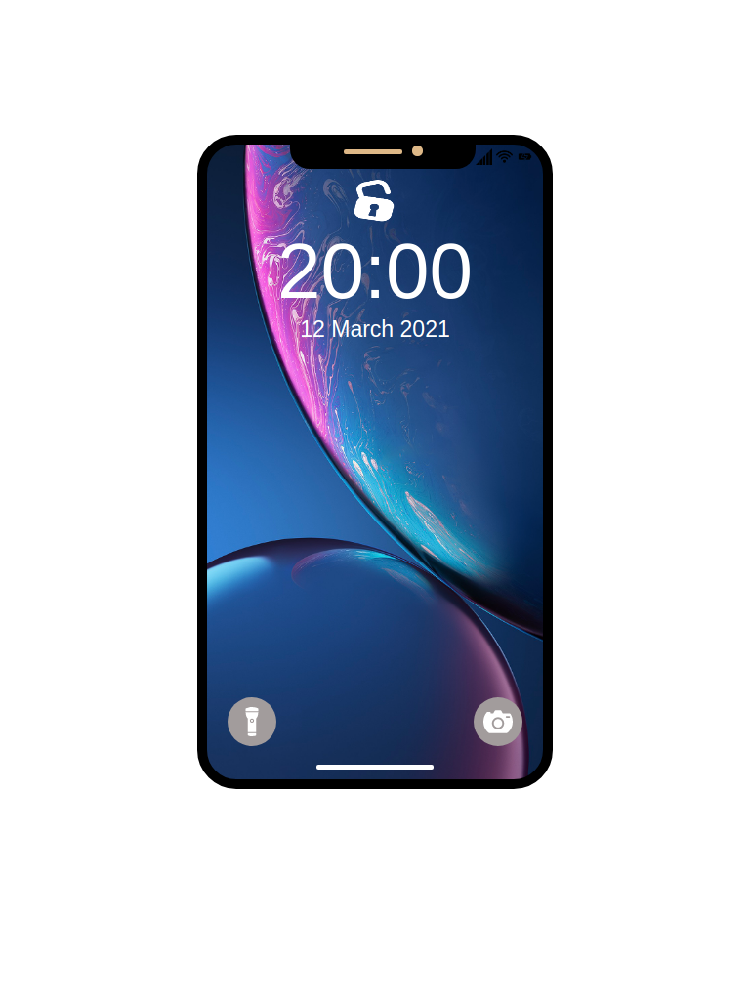

  ## Desenhando com CSS
  Vamos começar do mais simples, pra você utilizar:
  - Posicionamento
  - Borda
  - Gradiente
  - Box Shadow
  
  
  Nesse desafio você deverá desenhar só com CSS o iPhone. 
  Eu usei o 7, mas você é livre para escolher o modelo.
  
  #### Regras
  Só pode ser usado HTML e CSS.
  
  #### Requisitos
  Deve fazer parte do desenho:
  - Borda do iPhone, você pode chamar isso de frame ou moldura;
  - Tela
  - Sensor
  - Camera
  - Autofalante superios
  - Tela
  - Botão, o "Touch id".
  
  
 ## Modelo que eu fiz 👇
 
